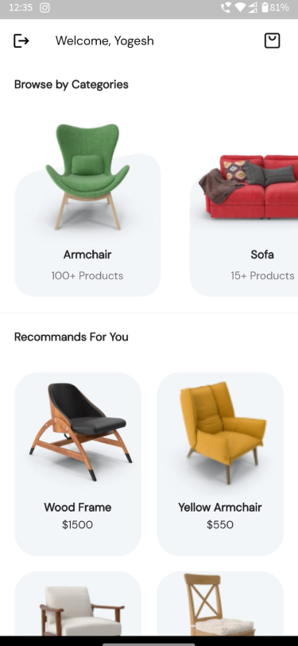
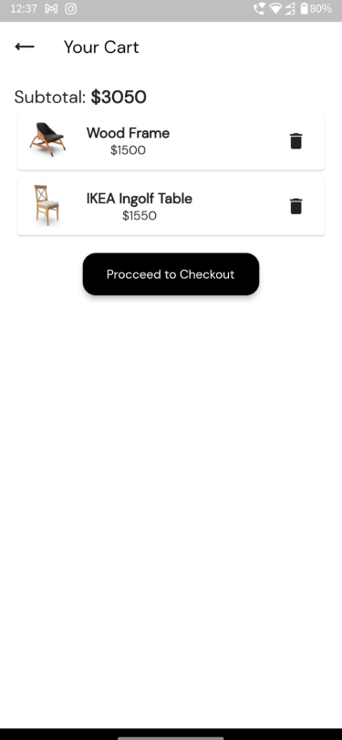

# A Flutter Furniture App

# Abstract:-
The furniture shopping system is a Flutter application that allows users to check out various furniture available in the store and purchase them online. 
The system provides a list of furniture products of different styles and models.
Users must log in to the system to browse each product and add them to their cart.
After selecting the products users can make a secure online payment.
Thus the online furniture shopping project brings an entire furniture shop online and makes it easy for both buyer and seller to make furniture deals Firebase is a backend to store user data.
Thus the online furniture shopping project brings an entire furniture shop online and makes it easy for both buyer and seller to make furniture deals.

# Tools and Technologies Used:-
1. Figma
2. Android Studio
3. Git and GitHub
4. Flutter
5. Dart
6. REST API
7. Razorpay
8. Firebase

# Implementation Details:-
1. Frontend is implemented Completely using Flutter.
2. Various furnitures are available in app to access for the cutomers.
3. Authentication is implementation using firebase auth for signup and signin of the users.
4. Our app is a CrossPlatform App, i.e we can use it in any platform like, android, iOS, Web etc.

# Maintenance:-
The whole authentication is managed by firebase or services for security and authorization of visitors.

# Application:-
1. The app made the physical buying of furniture to the online availability of wide variety and type.
2. As a result, we found that the application is the most effective strategy to expand the market for furniture stores. It will enable furniture buyers to easily search for and purchase furniture.
3. Easy transaction through payment gateway.
4. Work from home-Buy from home

# Future Enhancements:-
1. Website Layout
2. Google and Facebook authentication
3. Rating and reviews of products
4. Added feature of exchanging and selling furniture
5. Furniture Videos
6. Reward/Coupon system
7. Money Wallet payment

# Screenshots:

